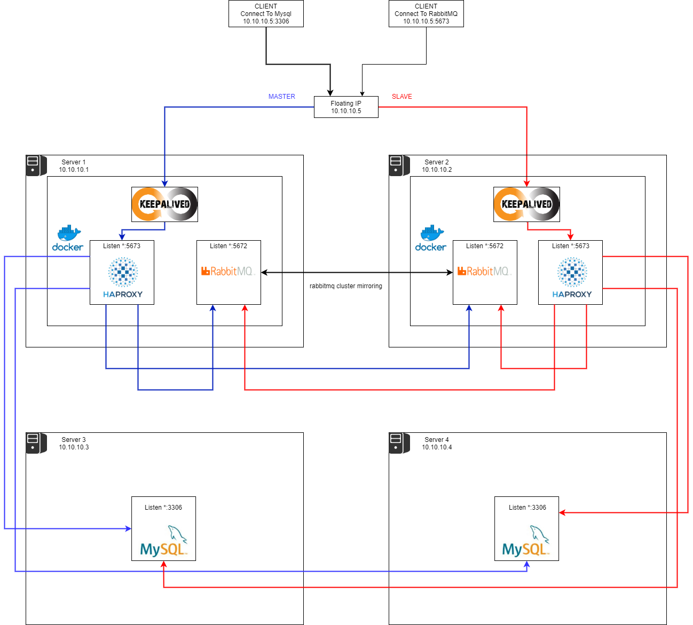

# High Availability, Load Balancer, For RabbitMQ and Mysql



## env
- config ./env/default.env
- config ./keepalived/keepalived.conf  ==> fix floating ip ( virtual_ip section )

## Usage
```
make up
make down
```
